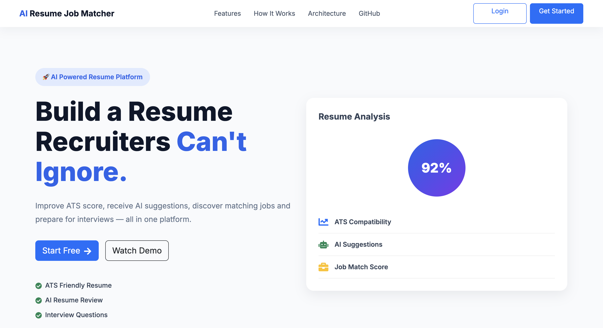
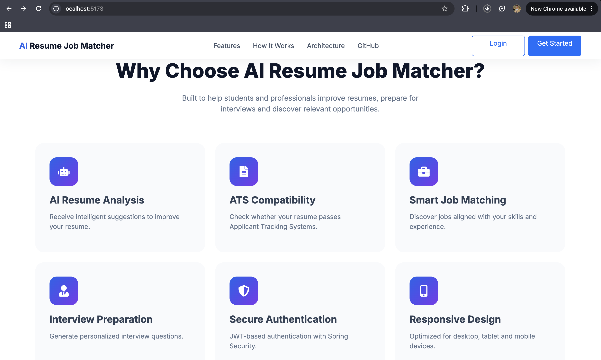
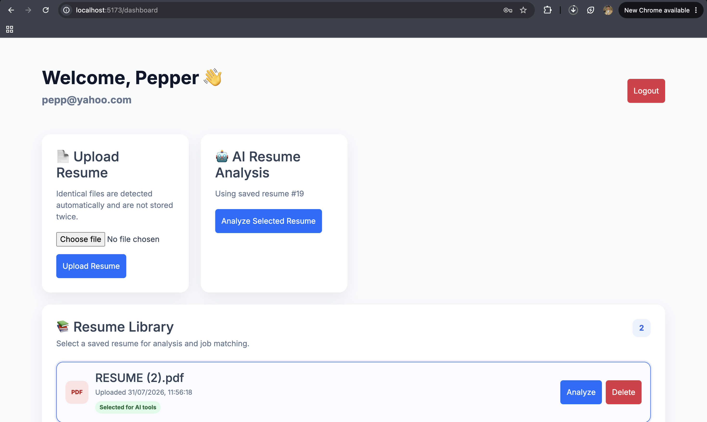
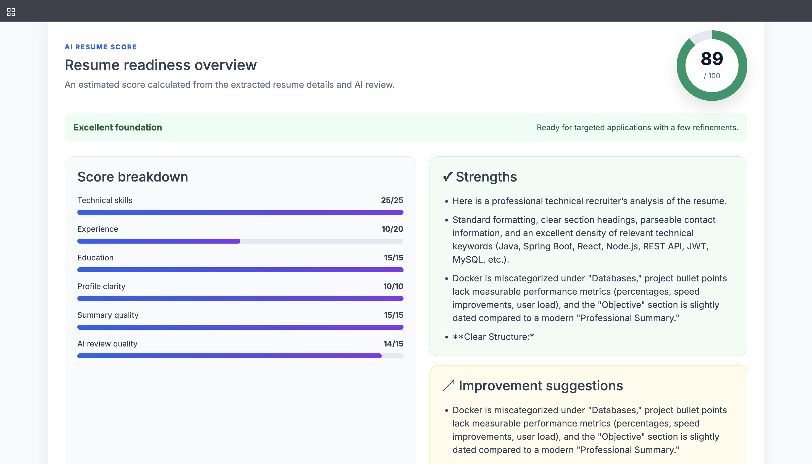
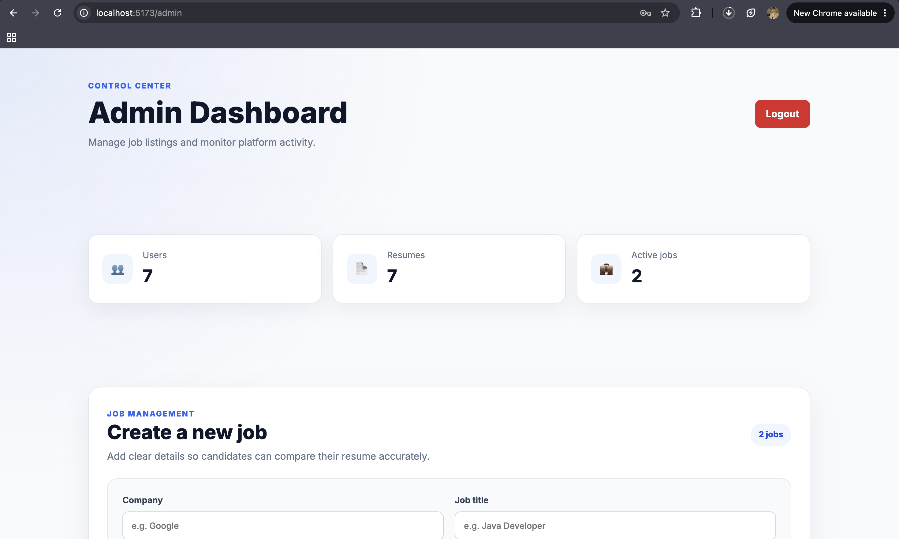

# 🚀 AI Resume Job Matcher

An AI-powered full-stack web application that helps users analyze resumes, match them against job descriptions, generate ATS-friendly feedback, create cover letters, and prepare for interviews using Google Gemini AI.

---

---

## 🌟 Application Preview



> AI-powered resume analysis, resume scoring, job matching, cover letter generation, interview preparation, and admin dashboard.

---


## 📸 Screenshots


### 🏠 Home Page


### 📊 User Dashboard


### 📄 Resume Analysis & Score


### 🛠️ Admin Dashboard


---

## ✨ Features

### 👤 Authentication
- User Registration & Login
- JWT Authentication
- Role-Based Authorization (User/Admin)

### 📄 Resume Management
- Upload PDF Resume
- Resume History
- Duplicate Resume Detection
- Delete Resume
- Analyze Latest or Any Uploaded Resume

### 🤖 AI Features
- AI Resume Analysis
- Resume Score Dashboard
- Resume Strengths & Suggestions
- Cover Letter Generator
- Interview Question Generator

### 💼 Job Matching
- Browse Available Jobs
- AI Resume vs Job Matching
- Match Score & Suggestions

### 🛠️ Admin Dashboard
- Dashboard Statistics
- Job CRUD Operations
- User & Resume Analytics

---

## 🏗️ Tech Stack

### Frontend
- React
- Vite
- React Router
- Axios
- CSS

### Backend
- Java 17
- Spring Boot
- Spring Security
- JWT Authentication
- Spring Data JPA

### Database
- MySQL

### AI
- Google Gemini API

### Tools
- Maven
- Git & GitHub
- IntelliJ IDEA
- VS Code
- Postman

---

## 📂 Project Structure

```
Ai-Resume-Job-Matcher
│
├── frontend/                 # React Frontend
│   ├── src/
│   ├── public/
│   └── package.json
│
├── src/                      # Spring Boot Backend
│
├── pom.xml
├── README.md
└── .gitignore
```

---

## ⚙️ Environment Variables

Create the following environment variables before running the backend.

| Variable | Description |
|----------|-------------|
| DB_URL | MySQL Database URL |
| DB_USERNAME | Database Username |
| DB_PASSWORD | Database Password |
| JWT_SECRET | JWT Secret Key |
| GEMINI_API_KEY | Google Gemini API Key |

---

## 🚀 Running Locally

### Backend

```bash
git clone https://github.com/adityaom589/Ai-Resume-Job-Matcher.git

cd Ai-Resume-Job-Matcher

./mvnw spring-boot:run
```

Backend runs on:

```
http://localhost:8080
```

---

### Frontend

```bash
cd frontend

npm install

npm run dev
```

Frontend runs on:

```
http://localhost:5173
```

---

## 📡 API Highlights

### Authentication

- Register
- Login
- JWT Authentication

### Resume

- Upload Resume
- Resume History
- Analyze Resume
- Delete Resume

### AI

- Resume Analysis
- Resume Score
- Cover Letter Generation
- Interview Questions

### Jobs

- List Jobs
- Resume vs Job Matching

### Admin

- Dashboard
- Job CRUD

---

## 🔮 Future Improvements

- Docker Support
- Email Notifications
- Resume Version Comparison
- Advanced ATS Scoring
- Cloud File Storage (AWS S3 / Cloudinary)
- CI/CD Pipeline

---

## 👨‍💻 Author

**Aditya Maurya**

GitHub:
https://github.com/adityaom589

---

## ⭐ Support

If you found this project helpful, consider giving it a ⭐ on GitHub.
